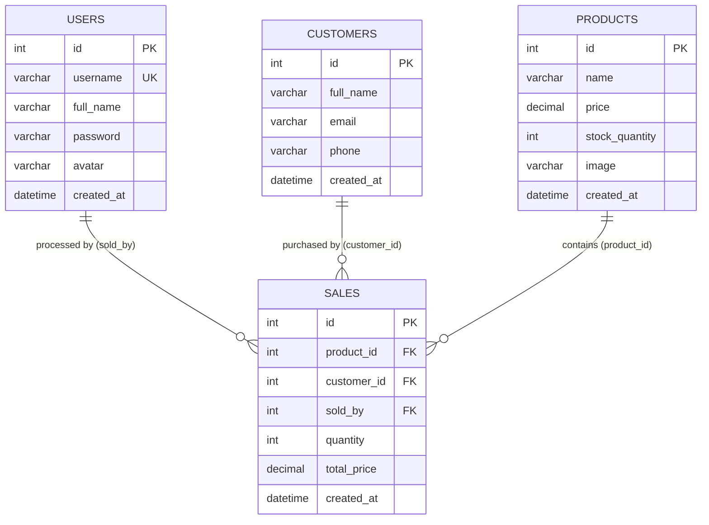

# THE COMPLETE POINT-OF-SALE SYSTEM

> **Four Beans Café — Web-Based Point-of-Sale (POS) & Inventory Management System**  
> Built with **CodeIgniter 4 (PHP 8.1+)**, **Bootstrap 5**, and **MySQL**.

---

## 📋 Academic Project Information

| Field | Details |
| :--- | :--- |
| **Student Name / Group Name** | **Group 3** |
| **Section** | **TW35** |
| **Professor** | **Sir. Mar Eli Sagsagat** |

### Group Members & Project Roles

| Name | Role |
| :--- | :--- |
| **Amiel Azucena** | UI/UX Designer |
| **Jefferson Tan** | Documentation & QA Tester |
| **Andrei Klein Serrano** | Documentation |
| **Ann Valerie Camacho** | Full Stack Developer |

---

## ☕ Project Overview

**The Complete Point-of-Sale System** for **Four Beans Café** is a full-featured, responsive web application tailored for coffee shops, bakeries, and retail food establishments. Developed using the **CodeIgniter 4** MVC framework, the system streamlines daily café operations by replacing manual logbooks with an automated, computerized workflow.

### Core Objectives
- **Fast Cashier Checkout:** Expedite counter transactions with live stock checking and instant total calculation.
- **Accurate Inventory Tracking:** Automatically deduct product stock levels immediately upon sale, preventing overselling.
- **Staff Accountability:** Every transaction is tied to the logged-in staff member or cashier.
- **Customer Relationship Management:** Maintain customer records to support loyalty recognition and purchase tracking.
- **Actionable Business Analytics:** Provide real-time sales summaries, transaction tallies, and low-inventory warnings.

---

## ✨ Key Features & Modules

### 1. 📊 Executive Dashboard
- **Daily Performance Metrics:** Live KPI cards for Today's Revenue (₱), Total Transactions, Active Menu Items, and Registered Customers.
- **Low Stock Alerts:** Automatically highlights products with stock quantity $\le 10$ units to ensure timely restocking.
- **Recent Transactions Log:** Real-time table showcasing the latest 10 sales orders with cashier attribution, timestamp, and totals.
- **Quick Action Navigation:** One-click shortcuts to record a sale, adjust inventory, manage customers, or update staff.

### 2. 🧾 Point-of-Sale (Record Sale) Terminal
- **Dynamic Product Selection:** Select items from active inventory with live stock badges and unit pricing.
- **Customer Assignment:** Link orders to registered regular customers or process as standard walk-in/guest purchases.
- **Real-Time Validation:** Automatic validation preventing orders exceeding current stock levels.
- **Automatic Inventory Deduction:** Instantly decrements product quantity upon checkout confirmation.

### 3. 📦 Product & Inventory Management (Full CRUD)
- **Menu Catalog:** Overview of all drinks, pastries, and merchandise with unit prices and remaining stock.
- **Add & Edit Products:** Add new items with customizable name, price, initial inventory, and product image uploads.
- **Stock Status Badges:** Visual indicators for *In Stock*, *Low Stock*, and *Out of Stock*.
- **Image Handling:** Automatic storage and replacement of uploaded product photos (`public/uploads/products/`).

### 4. 👥 Customer Management (Full CRUD)
- **Customer Directory:** Manage customer profiles including Full Name, Email Address, and Phone Number.
- **Order Association:** Connect customer profiles to sales transactions for customer history tracking.
- **Profile Updates & Deletion:** Edit customer contact information or remove outdated entries.

### 5. 🔐 Staff & Cashier Administration (Full CRUD)
- **Access Control:** Manage authorized staff members and cashier accounts.
- **Secure Password Hashing:** Credentials encrypted using PHP's native `password_hash()` with `PASSWORD_DEFAULT` (bcrypt).
- **Profile Avatars:** Upload and update staff profile photos (`public/uploads/avatars/`).
- **Safety Protections:** Built-in safeguards preventing staff from deleting their own active logged-in accounts.

### 6. 📜 Sales History & Audit Logs
- **Complete Transaction Ledger:** Detailed records of every order completed in the system.
- **Comprehensive Details:** Displays Transaction ID, Date & Time, Cashier Name, Customer Name, Product Name, Quantity, and Total Amount (₱).

---

## 🛠️ Technology Stack

| Component | Technology | Description |
| :--- | :--- | :--- |
| **Backend Framework** | [CodeIgniter 4](https://codeigniter.com/) (v4.x) | Lightweight, high-performance PHP MVC framework |
| **Runtime** | PHP 8.1 / 8.2 | Modern PHP engine with `intl`, `mbstring`, `curl`, and `mysqli` |
| **Database** | MySQL / MariaDB | Relational database with foreign key integrity and ACID compliance |
| **Frontend UI** | Bootstrap 5.3 & Bootstrap Icons | Responsive, mobile-ready layout with warm coffee-house aesthetics |
| **Web Server** | Apache 2 | HTTP server with `mod_rewrite` enabled for clean URLs |
| **Containerization** | Docker | Production container image for deployment |
| **Cloud Hosting** | Railway | Cloud platform deployment configuration (`railway.json`, `start.sh`) |

---

## 🗄️ Database Architecture & Schema

The system uses automated CodeIgniter 4 database migrations (`CreateFourBeansTables.php`) with 4 interconnected tables:



---

## 🔑 Pre-Seeded Default Accounts

For evaluation, grading, and testing purposes, the database seeder (`FourBeansSeeder.php`) provides the following accounts:

| Username | Password | Full Name | Role / Access |
| :--- | :--- | :--- | :--- |
| `ann` | `admin123` | Ann Valerie Camacho | Administrator / Cashier |
| `amiel` | `amiel123` | Amiel Azucena | Staff / Cashier |
| `jefferson` | `jefferson123` | Jefferson Tan | Staff / Cashier |
| `andrei` | `andrei123` | Andrei Klein Serrano | Staff / Cashier |

---

## 🚀 Local Installation & Setup Guide

### Prerequisites
1. **PHP 8.1 or higher** (with extensions: `intl`, `mbstring`, `mysqli`, `curl`).
2. **MySQL / MariaDB** (via XAMPP, WAMP, or standalone).
3. **Composer** (PHP dependency manager).
4. **Apache Web Server** with `mod_rewrite` enabled.

---

### Step-by-Step Setup

#### 1. Place or Clone the Project
Clone or copy the project into your local server root (e.g. for XAMPP on Windows):
```bash
c:\xampp\htdocs\Midterm
```

#### 2. Create the MySQL Database
Open your MySQL terminal or **phpMyAdmin** (`http://localhost/phpmyadmin`) and execute:
```sql
CREATE DATABASE fourbeansdb CHARACTER SET utf8mb4 COLLATE utf8mb4_general_ci;
```

#### 3. Configure the Environment File (`.env`)
In the root directory of the project, make sure `.env` contains your database credentials:
```ini
CI_ENVIRONMENT = development

database.default.hostname = localhost
database.default.database = fourbeansdb
database.default.username = root
database.default.password =
database.default.DBDriver = MySQLi
database.default.port = 3306
```
*(Note: If your local MySQL `root` user has a password, enter it in `database.default.password`.)*

#### 4. Run Migrations & Seed Default Data
Open a terminal in the project directory (`c:\xampp\htdocs\Midterm`) and run:
```bash
# Run schema migrations
php spark migrate

# Seed staff accounts, sample products, and sample customers
php spark db:seed FourBeansSeeder
```

#### 5. Launch the Application

**Option A: Using CodeIgniter Built-in Server (Recommended for testing):**
```bash
php spark serve
```
Then navigate to: **`http://localhost:8080`**

**Option B: Using XAMPP Apache:**
Start Apache and MySQL in XAMPP Control Panel.  
Navigate to: **`http://localhost/Midterm/public`**

#### 6. Log In
Use any of the pre-seeded credentials listed above (e.g. `ann` / `admin123` or `amiel` / `amiel123`).

---

## 🐳 Docker & Cloud Deployment (Railway)

The repository includes a ready-to-run `Dockerfile` and dynamic initialization script (`start.sh`) for containerized deployment:

### Run with Docker Locally
```bash
# Build the Docker image
docker build -t fourbeans-pos .

# Run the container mapping port 8080 to container port 80
docker run -d -p 8080:80 --name fourbeans-container fourbeans-pos
```

### Deploying to Railway
1. Create a new project on [Railway](https://railway.app).
2. Provision a **MySQL** database service.
3. Link your GitHub repository (`valeriecmcho/Midterm`).
4. Railway will automatically detect the `Dockerfile` and `railway.json`.
5. The deployment script `start.sh` automatically:
   - Configures Apache to listen on Railway's dynamic `$PORT`.
   - Ensures write permissions on `/var/www/html/writable` and `/var/www/html/public/uploads`.
   - Runs database migrations (`php spark migrate --all --force`).
   - Seeds initial accounts and products (`php spark db:seed FourBeansSeeder`).
   - Starts Apache in the foreground.

---

## 📁 Project Directory Structure

```plaintext
Midterm/
├── app/
│   ├── Config/
│   │   ├── Database.php          # Database connection settings & Railway auto-detection
│   │   ├── Routes.php            # Application route definitions & route groups
│   │   └── ...
│   ├── Controllers/
│   │   ├── Auth.php              # Login, authentication & session destruction
│   │   ├── Dashboard.php         # Analytics, KPI counters, and recent transactions
│   │   ├── Products.php          # Product catalog & stock inventory CRUD
│   │   ├── Customers.php         # Customer profiles CRUD
│   │   ├── Staff.php             # Staff & cashier account administration CRUD
│   │   ├── RecordSale.php        # POS checkout logic & real-time stock deduction
│   │   └── SalesHistory.php      # Sales ledger & transaction audit trail
│   ├── Database/
│   │   ├── Migrations/           # Database migration files (table schemas)
│   │   └── Seeds/                # Seeder files (default users, menu items, customers)
│   ├── Filters/
│   │   └── AuthFilter.php        # Route protection filter for authenticated users
│   ├── Models/
│   │   ├── CustomerModel.php     # Customer entity data model
│   │   ├── ProductModel.php      # Product entity data model
│   │   ├── SaleModel.php         # Sales transaction model with relational joins
│   │   └── UserModel.php         # User/staff authentication model
│   └── Views/
│       ├── customers.php         # Customer management view & modals
│       ├── dashboard.php         # Executive dashboard & KPI overview
│       ├── login.php             # Modern café-themed login interface
│       ├── products.php          # Inventory management view & modals
│       ├── record_sale.php       # POS terminal & order processing screen
│       ├── sales_history.php     # Complete transaction audit table
│       └── staff.php             # Staff administration view & modals
├── public/
│   ├── index.php                 # Front controller entry point
│   └── uploads/
│       ├── avatars/              # Uploaded staff profile photos
│       └── products/             # Uploaded product image files
├── writable/                     # Cache, session, and log directory
├── .env                          # Local environment and database configuration
├── Dockerfile                    # Containerization instructions
├── railway.json                  # Railway deployment specifications
├── spark                         # CodeIgniter CLI executable tool
└── start.sh                      # Production startup script (migrations, port binding)
```

---

## 📄 License & Attribution

This project is developed for educational purposes as part of the academic coursework for **TW35** under **Sir. Mar Eli Sagsagat**.
Built with the [CodeIgniter 4](https://codeigniter.com) Framework under the [MIT License](LICENSE).
